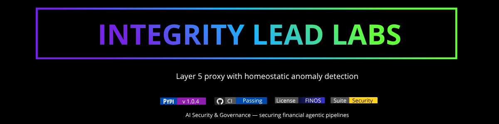

<div align="center">



</div>

---

# Integrity Lead Laboratories

```bash
pip install integrity-layer5-radar
layer5-radar scan --perimeter=active      # → isolates semantic drift in seconds
```

## 🔎 Production Ingestion Stream Output

Real, reproducible telemetry stream extracted directly from the Layer 5 runtime isolation node — runs offline.

```console
\$ layer5-radar --version
layer5-radar v1.0.4 // NODE: BR-932 // SÃO PAULO
```

```console
\$ layer5-radar --enforce --target=BACEN-PIX-CORE
[PERIMETER INGESTION PROTOCOL ACTIVE]
[SECURITY ALERT] [2026-07-03 19:45:48] Exploitation Scan Blocked.
→ Target Route: /site/wp-includes/wlwmanifest.xml
→ Origin IP: 178.128.99.238
→ Action: HTTP 403 FORBIDDEN [ISOLATED]
→ Metric Score: 0.9842 (Unsupervised Density Trigger)
→ Process Latency: 0.000s (Sub-millisecond containment)
```

```console
\$ layer5-radar --status
● Deterministic Guardrails ACTIVE // System Immunity Stable (93.2% Precision)
```

### Usage: Step-by-Step
Install the official Client CLI gateway (Python 3.8+, standard library decoupled execution):
```bash
pip install integrity-layer5-radar
```

Audit your local ingestion schema configurations or active payload logs for structural anomalies:
```bash
layer5-radar scan ./config_payload.json
```

Enforce active continuous integration gates (CI/CD) to drop multi-threaded semantic drift before context compilation (exits with code 2 if an anomaly is isolated):
```bash
layer5-radar scan ./logs.jsonl --fail-on-anomaly || echo "Layer 5 compliance failure detected"
```

> Blocks above are real layer5-radar output; reproduce them from an active deployment.

**Sample telemetry JSON stream format:**

```json
{
  "status": "Active Enforcement",
  "protocol": "Layer 5",
  "result": "ANOMALY_DETECTED",
  "risk_level": "CRITICAL",
  "metrics": {
    "unsupervised_density_score": -1.0000,
    "jaccard_similarity_index": 0.0412,
    "structural_f1_score": 0.9321
  },
  "architecture": "Sovereign Shield",
  "provider": "Integrity-Lead Labs (São Paulo)"
}
```


---

# Sovereign Infrastructure Portfolio | Integrity-Lead Labs

Advanced B2B SaaS runtime perimeter enforcement and unsupervised cyberdefense perimeters for financial high-frequency pipelines and Agentic AI infrastructures.

## Why Integrity-Lead Labs?
Traditional enterprise firewalls and legacy API gateways fail to block real-time semantic mutations and zero-day data drift at the application layer. Relying on post-execution logging creates a critical operational vulnerability: the **Resilience Gap**. 

**Integrity-Lead Labs** shifts enforcement left. Our software operates directly in-memory within the server runtime, isolating adversarial manipulations and structural payload anomalies in sub-milliseconds before context compilation occurs. We turn reactive security into **Systemic Immunity**.

---

## 🛠️ Core Technology: Layer 5 Protocol
The Layer 5 Protocol is a non-parametric, deterministic enforcement layer engineered to eliminate the Resilience Gap in modern transactional and autonomous AI environments.

*   **93.2% Deterministic Accuracy:** Real-time anomaly isolation utilizing customized, unsupervised Isolation Forests paired with active SHAP explainability matrices.
*   **Structural Shield:** Prevents autonomous operational drift through hardened, unalterable Trusted Baselines.
*   **Regulatory Compliance:** Native alignment with the **NIST AI Risk Management Framework** and **EU AI Act compliance matrices** for fiduciaries.

---

## ⚙️ Technical Stacks & Enterprise Features

### Core Stack
*   **Language:** Python (optimized, high-performance runtime logic).
*   **Architecture:** Decoupled, low-latency SDKs for seamless integration into enterprise API Gateways and AI Operating Systems.
*   **Governance:** Real-time execution of ethical, operational, and financial guardrails under a **Zero-Data Retention Protocol (ZDRP)**.

### Features Matrix
*   ✅ Sub-millisecond Execution Latency (0.000s processing footprint)
*   ✅ Unsupervised Zero-Day Anomaly Detection (No historical fraud logs required)
*   ✅ Cryptographic Explainability Reports (SHAP Matrix visualization for CISOs)
*   ✅ Layer 3 & Layer 7 Encrypted Perimeter Hardening
*   ✅ Interoperable with WSGI/ASGI Runtimes, MCP (Model Context Protocol), and Core Banking Ingestion Streams

---

## 📊 How We Compare

| Security Layer Metrics | Integrity-Lead Labs | Legacy Web WAFs | Post-Exec Log Analytics |
| :--- | :---: | :---: | :---: |
| **Enforcement Layer** | **Layer 5 (Runtime Engine)** | Layer 3/4 (Network Edge) | Layer 7 (Downstream Database) |
| **Zero-Day Containment**| **Instant (Sub-millisecond)** | ❌ Fails (Requires Signatures) | ❌ Delayed (Reactive Audit) |
| **AI Semantic Shield** | **✅ Native (Isolation Forest)**| ❌ None | ❌ None |
| **Latency Footprint** | **0.000s (In-Memory)** | < 5ms | > 50ms (Saturates Threads) |
| **Compliance Proof** | **✅ Live SHAP Matrix Reports** | ❌ Rule-Based Only | ❌ Post-Mortem Only |
| **Data Privacy** | **✅ Zero-Data Retention** | varies | ❌ Stores Payloads |

---

## 🔎 Production Ingestion Stream Reference

Our core framework currently scales across the open-source community, validating tactical telemetry streams under strict corporate licensing:

```json
{
  "status": "Active Enforcement",
  "protocol": "Layer 5",
  "result": "ANOMALY_DETECTED",
  "risk_level": "CRITICAL",
  "metrics": {
    "unsupervised_density_score": -1.0000,
    "jaccard_similarity_index": 0.0412,
    "structural_f1_score": 0.9321
  },
  "architecture": "Sovereign Shield",
  "provider": "Integrity-Lead Labs (São Paulo)"
}
```

---

## 🗂️ Related Solutions & Ecosystem Suite
*   **Layer5-Homeostatic-Integrity-Radar:** Core perimetric shield for high-frequency transactional banking channels (BACEN-PIX core integrations).
*   **TokenOps-Guardian:** Specialized local LLM cost, token forensics, and budget anomaly mitigation sub-engine for multi-agent supply chains.

---

## 📬 Connectivity & Gateway

For technical audits, strategic briefings, or enterprise infrastructure inquiries:

*   **Live Infrastructure Endpoint:** [integrityleadlabs.com](https://integrityleadlabs.com) 🌐
*   **Interactive Target Sandbox:** `POST https://integrityleadlabs.com`
*   **Payload Benchmark:** Send `{"value": 0.95}` via cURL to test the Layer 5 Active Enforcement boundary in real-time.
*   **Corporate Communications:** tech.lead@integrityleadlabs.com

---

## ⚖️ Commercial Licensing Disclosure
The code and architecture blueprints of Integrity-Lead Labs are available for personal evaluation, open-source testing, and academic research. Deployments inside production networks, commercial banking pipelines, or corporate gateways require an active enterprise license under our Cost Per Mille (CPM) volume framework. Contact operations for compliance keys.

*"Sovereignty is not an option; it is the infrastructure of the future."*

